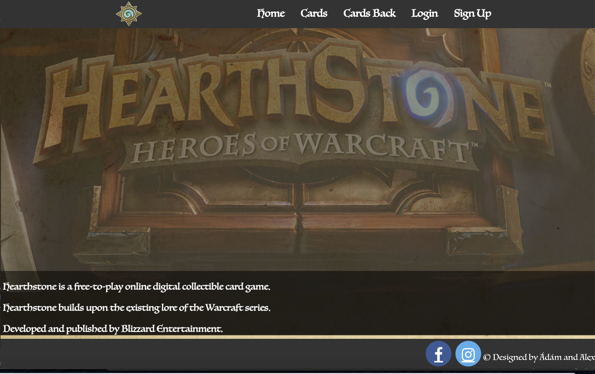

# HeartStone BackEnd

This repository shows us the back-end part of the 
Hearth Stone project written in ASP .NET CORE. 

## Basic Information
In HeartStone every character are derived from the World of Warcraft in 
the forms of cards. In this website you are able to discover these cards 
and see relevant information about the characters.

## Relevant information
This repository is responsible giving the content to the front-end part which can be cloned from https://github.com/alexseres/FrontEnd.
They are communicating via REST API's.

## Contributing
Pull requests are welcome. For major changes, please open an issue first to discuss what you would like to change.

Please make sure to update tests as appropriate.
